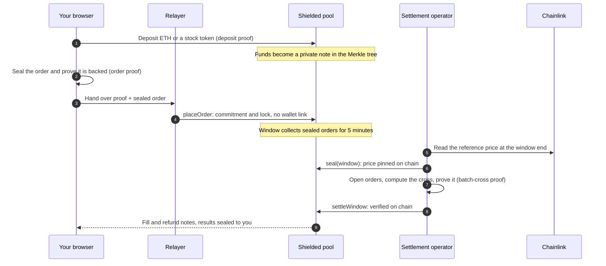
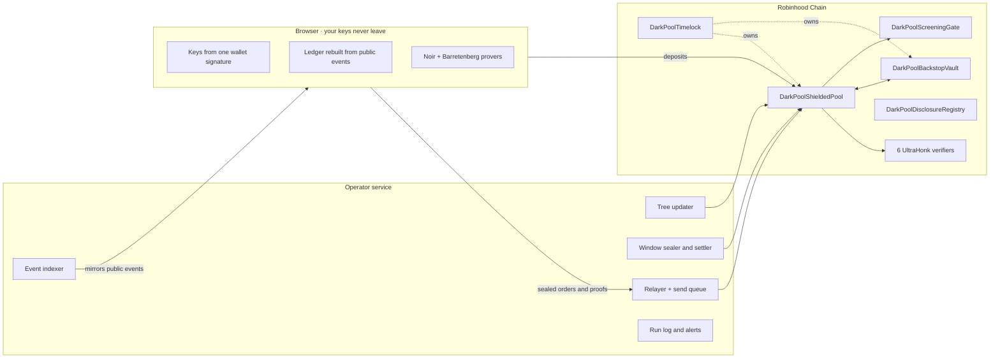

<div align="center">


# DarkpoolFi

### Sealed stock-token execution on Robinhood Chain

**Your order shouldn't be public before it fills.**<br/>
Orders are sealed, proven in your browser, and crossed in fixed windows where everyone gets the same price.

<br/>

[](https://robinhoodchain.blockscout.com/address/0xFCa786642cEeB58F4cC1543B5d7FC91cdD254B93)
[](#zero-knowledge-circuits)
[](#smart-contracts)
[](#architecture)

[**Website**](https://darkpoolfi.tech) &nbsp;·&nbsp; [**Dashboard**](https://darkpoolfi.tech/dashboard) &nbsp;·&nbsp; [**Docs**](https://darkpoolfi.tech/docs) &nbsp;·&nbsp; [**Transparency**](https://darkpoolfi.tech/transparency) &nbsp;·&nbsp; [**X**](https://x.com/DarkPoolFi) &nbsp;·&nbsp; [**Telegram**](https://t.me/darkpoolfi)

<br/>


</div>

<br/>

## Contents

- [Why DarkpoolFi](#why-darkpoolfi)
- [How a trade works](#how-a-trade-works)
- [Architecture](#architecture)
- [Order types](#order-types)
- [Zero-knowledge circuits](#zero-knowledge-circuits)
- [Smart contracts](#smart-contracts)
- [Privacy and trust model](#privacy-and-trust-model)
- [Repository layout](#repository-layout)
- [Building and verifying](#building-and-verifying)
- [Security](#security)

---

## Why DarkpoolFi

On a public chain, an order is a signal. It sits in the mempool and in the book, readable by anyone, before it trades. Size, side and limit leak, and the trader pays for it.

DarkpoolFi removes the signal instead of racing it.

| | Public order book | DarkpoolFi |
|---|---|---|
| **Order contents before execution** | Visible to everyone | Sealed; only a commitment is on chain |
| **Price** | Whatever the book gives you | One Chainlink reference price per window, the same for every participant |
| **Link to your wallet** | Every order signed by your address | Proofs are relayed; your wallet appears only when you deposit |
| **Balances** | Public token balances | Private notes that only your keys can read |
| **Results** | Public fills | Sealed to each owner; a delayed, aggregated public tape |

<br/>

## How a trade works



1. **Deposit.** ETH or a stock token enters the shielded pool as a *note*: a hash of owner, asset, amount and blinding. The deposit is the only step that touches your wallet.
2. **Seal.** Your browser builds the order, seals it, and proves in zero knowledge that it is backed by a note you own. The relayer submits it, so the order is never linked to your address.
3. **Collect.** Orders gather in a fixed **5-minute window**. Nobody sees what is inside.
4. **Cross.** At the window end the Chainlink reference is pinned on chain. Every eligible order crosses at that one price. A backstop liquidity book fills what the cross leaves over, within a bounded spread.
5. **Settle.** The cross is proven with a single batch proof and verified by the contract. Each owner receives fill and refund notes plus a result only they can open.

<br/>

## Architecture



| Layer | What it does | Where |
|---|---|---|
| **Contracts** | Hold notes, verify every state change against a proof, pin reference prices, run the backstop book | `contracts/src` |
| **Circuits** | Deposit, tree update, transact, order validity, reclaim and batch cross, written in Noir | `circuits/` |
| **Browser client** | Derives keys, rebuilds the account from public data, proves locally, seals orders and RFQ messages | `src/shielded` |
| **Operator** | Indexes events, advances the tree, seals and settles windows, relays proofs, rebalances the backstop | `src/server/darkpool` |
| **Data mirror** | Public event mirror and operator bookkeeping, locked to the service role | `supabase/migrations` |
| **Interface** | Trading desk, private balance with PnL, shielded pool, activity, English and 中文 | `src/pages`, `public/` |

<br/>

## Order types

| Type | Behaviour |
|---|---|
| **Standard** | Crosses at the window reference; the unfilled part is released or kept for the next windows |
| **Price limit** | Eligible only while the reference is within your limit |
| **Minimum fill** | Fills at least a chosen size, or not at all |
| **Iceberg** | Shows only a slice of the order in each window |
| **TWAP** | Spreads the order over 2 to 12 windows |
| **Pegged** | Trades against the backstop book within a maximum spread you set |
| **RFQ block** | A block negotiated privately with one counterparty; the pair crosses whole, at the reference, before the window cross |

<br/>

## Zero-knowledge circuits

All circuits are written in [Noir](https://noir-lang.org) and proven with Barretenberg **UltraHonk**. Each has its own on-chain verifier.

| Circuit | Proves | Proven by |
|---|---|---|
| `deposit` | A note commitment matches the deposited asset and amount | Browser |
| `transact` | Spending up to two notes into two outputs, with a withdrawal and relayer fee bound to the proof | Browser |
| `order_validity` | A sealed order is backed by an unspent note, with change and relayer fee accounted for | Browser |
| `reclaim` | The owner of an order in an abandoned window takes its lock back | Browser |
| `tree_update` | A batch of 16 commitments was appended to the depth-20 Merkle tree correctly | Operator |
| `batch_cross` | A whole window of up to 64 orders was crossed correctly: fills, refunds, rollovers, fees and backstop legs | Operator |

`batch_cross` checks the crossing result against prover-supplied allocations in linear time, instead of sorting inside the circuit.

<br/>

## Smart contracts

Deployed on **Robinhood Chain mainnet (chain id 4663)**.

| Contract | Address |
|---|---|
| Shielded pool | [`0xFCa786642cEeB58F4cC1543B5d7FC91cdD254B93`](https://robinhoodchain.blockscout.com/address/0xFCa786642cEeB58F4cC1543B5d7FC91cdD254B93) |
| Backstop vault | [`0xA7607E0De63b4F908e6E86b597ECFBad6F04344D`](https://robinhoodchain.blockscout.com/address/0xA7607E0De63b4F908e6E86b597ECFBad6F04344D) |
| Screening gate | [`0x3482ca7f3095D43BC4dCD31778de1535F7D839Bc`](https://robinhoodchain.blockscout.com/address/0x3482ca7f3095D43BC4dCD31778de1535F7D839Bc) |
| Disclosure registry | [`0x489d22e768Fbe852453985CADfde562CB9f8aA5C`](https://robinhoodchain.blockscout.com/address/0x489d22e768Fbe852453985CADfde562CB9f8aA5C) |
| DARK token | [`0x073407b2ba247e88a3183849ec2817512171d7ef`](https://robinhoodchain.blockscout.com/address/0x073407b2ba247e88a3183849ec2817512171d7ef) |

**Protocol parameters**

| Parameter | Value |
|---|---|
| Crossing window | 300 seconds |
| Orders per market across open windows | 64 |
| Venue fee | 5 bps of ETH value, per side |
| Backstop spread | 50 bps (hard cap 200 bps) |
| Settlement deadline | 1 hour after the window; after that, owners reclaim their locks themselves |
| Tree | Depth 20, appended in batches of 16 |
| Markets | AAPL · AMZN · MSFT · NVDA · TSLA |

The pool and the backstop vault are owned by a timelock. Verifiers are immutable.

<br/>

## Privacy and trust model

We would rather state the boundaries precisely than promise more than the system does.

**Private**
- The contents of an order (side, size, limit) before settlement.
- Which note an order or withdrawal spends, and your balances: they are notes that only your keys can read.
- The link between your wallet and your orders or withdrawals, which the relayer submits.
- Your fills and refunds, sealed to you.

**Public**
- Deposits, and the wallet they come from.
- That an order was placed in a market and window, and the reference price each window crossed at.
- Aggregated results on a delayed public tape.
- The solvency report, signed every hour and verifiable by anyone.

**Trust assumptions today**
- The settlement operator can open sealed orders in order to settle them. A threshold committee that removes this ability is implemented and tested, and is not yet active.
- If a window is not settled, no order lock is stuck: after the settlement deadline anyone can abandon the window, and every owner reclaims their lock with a proof.
- Deposits pass a screening gate, and withdrawals prove membership in a published association set. Compliance works without revealing which deposit a withdrawal comes from.
- **Selective disclosure.** An owner can grant an auditor read access to their own account through the disclosure registry. It never grants spending rights.

<br/>

## Repository layout

```text
.
├── circuits/              Noir circuits and the shared library
│   ├── lib/               Poseidon2 notes, nullifiers, Merkle paths, order terms
│   ├── deposit/ transact/ order_validity/ reclaim/
│   ├── tree_update/ batch_cross/
│   └── tests/             Parity checks between TypeScript and Noir
├── contracts/             Solidity: pool, backstop vault, gate, registry, timelock, token
│   ├── src/verifiers/     Generated UltraHonk verifiers
│   └── test/              Foundry tests, including mainnet-fork tests
├── src/
│   ├── shielded/          Browser client: keys, ledger, proving, orders, RFQ, PnL
│   ├── server/darkpool/   Operator: indexer, tree, windows, relayer, send queue, backstop, solvency
│   ├── routes/            Pages, public API and scheduled jobs
│   └── pages/             Page markup
├── public/                Interface controllers, styles, translations, assets
├── supabase/
│   ├── migrations/        Schema and SQL functions, re-runnable
│   └── checks/            Database checks against in-memory Postgres
└── scripts/               Checks, translation tooling, prover packaging
```

<br/>

## Building and verifying

**Prerequisites:** [Bun](https://bun.sh), Node.js, [Foundry](https://getfoundry.sh) for the contracts, and [Nargo](https://noir-lang.org/docs/getting_started/quick_start) with Barretenberg to rebuild circuits.

```bash
bun install
cp .env.example .env.local   # fill in your own endpoints and keys
bun run dev                  # local interface and API
bun run build                # production build, provers packaged
```

**Contracts**

```bash
cd contracts
git clone --depth 1 https://github.com/foundry-rs/forge-std lib/forge-std
forge test
```

**Checks.** Critical paths each have a runnable check. Most run in memory; the circuit parity check needs Nargo and Barretenberg.

```bash
bun src/shielded/shielded.check.ts        # hashes match the circuits, sealed messages round-trip
bun src/shielded/rfq-negotiation.check.ts # sealed RFQ negotiation and block commitment
bun src/shielded/pnl.check.ts             # average-cost PnL
bun supabase/checks/pool.check.ts         # event mirror and window bookkeeping
bun supabase/checks/sends.check.ts        # operator send queue and alert de-duplication
bun circuits/tests/parity.check.ts        # TypeScript and Noir agree on every hash
node scripts/i18n-runtime.check.mjs       # translations of runtime text
```

<br/>

## Security

Security is the product. If you believe you have found a vulnerability, **please do not open a public issue.** Contact us privately through [X](https://x.com/DarkPoolFi) or [Telegram](https://t.me/darkpoolfi), and give us reasonable time to investigate and fix before disclosure.

Operator keys, database credentials and deployment runbooks are not part of this repository.

---

<div align="center">


**DarkpoolFi** · Private execution on Robinhood Chain

<sub>Trading tokenized equities carries risk. Nothing in this repository is investment advice.</sub>

</div>
